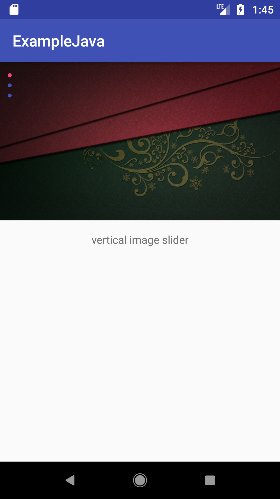
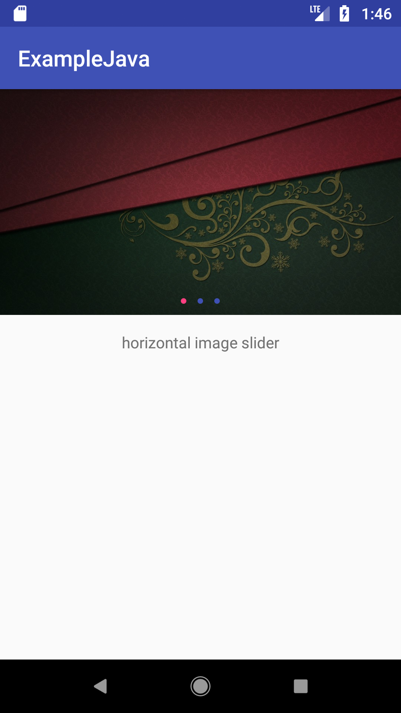

# Image Slider
Library to implement the image slider from viewpager (minSdkVersion=15).<br>

## Screenshots
<div style="display:flex;" >


</div>

## How to?

#### Gradle
```groovy
dependencies {
    implementation 'com.pickth:imageslider:1.0.9'
}
```

#### XML
```xml
<com.pickth.imageslider.view.ImageSlider
    android:id="@+id/is_main"
    android:layout_width="match_parent"
    android:layout_height="wrap_content" />
```

#### Java
```java
@Override
protected void onCreate(Bundle savedInstanceState) {
    super.onCreate(savedInstanceState);
    setContentView(R.layout.activity_main);

    ArrayList<Integer> items = new ArrayList<>();
    items.add(R.drawable.a);
    items.add(R.drawable.b);
    items.add(R.drawable.c);

    ImageSlider is = findViewById(R.id.is_main);
    is.addItems(items);
    
    is.setOnImageTouchListener(new OnImageTouchListener() {
                @Override
                public void onClickListener(int position) {
                    // do something
                }
    
                @Override
                public void onLongClickListener(int position) {
                    // do something
                }
            });
}
```

#### Kotlin
```kotlin
override fun onCreate(savedInstanceState: Bundle?) {
    super.onCreate(savedInstanceState)
    setContentView(R.layout.activity_main)

    var items = ArrayList<Int>().apply {
        add(R.drawable.habit)
        add(R.drawable.movie_image)
        add(R.drawable.movie_image)
        add(R.drawable.movie_image)
    }

    is_main.addItems(items)
    
    is_main.setOnImageTouchListener(object: OnImageTouchListener {
                override fun onClickListener(position: Int) {
                    // do something
                }
    
                override fun onLongClickListener(position: Int) {
                    // do something
                }
            })
}
```

#### Customization options

```xml
<com.pickth.imageslider.view.ImageSlider
    android:id="@+id/is_main"
    android:layout_width="match_parent"
    android:layout_height="wrap_content"
    app:orientation="vertical"
    app:background_color="@color/colorAccent"
    app:indicator_color="@color/colorPrimary"
    app:indicator_selected_color="@color/colorAccent" />
```

**orientation**<br>
Set the slide direction of slider.

**background_color**<br>
If slider is larger than image, set the background color of the blank space.

**indicator_color**<br>
Set color representing the position of the unselected image.

**indicator_selected_color**<br>
Set color representing the position of the image.

## Caution

If use images of different size, fix the height of slider.
Otherwise, slider is unstable.


## LICENSE
```
Copyright 2017 Yonghoon Kim

Licensed under the Apache License, Version 2.0 (the "License");
you may not use this file except in compliance with the License.
You may obtain a copy of the License at

    http://www.apache.org/licenses/LICENSE-2.0

Unless required by applicable law or agreed to in writing, software
distributed under the License is distributed on an "AS IS" BASIS,
WITHOUT WARRANTIES OR CONDITIONS OF ANY KIND, either express or implied.
See the License for the specific language governing permissions and
limitations under the License.
```